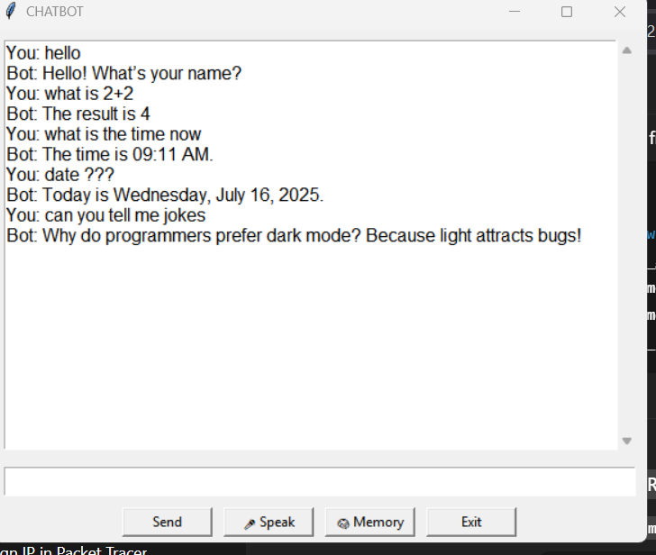

 
# Chatbot  

A desktop AI chatbot built using Python and Tkinter. Features include:

- 🗨️ GUI chat interface
- 🎤 Voice input
- 🧠 Memory with toggleable display
- 📅 Date and time answers
- 🤣 Jokes
- ➗ Math calculations
- ## 🖼️ Screenshot

Here’s how the chatbot looks:





## How to Run

### Install dependencies:

```bash
pip install -r requirements.txt
